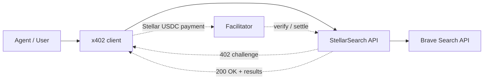

# StellarSearch

Pay-per-query web search for AI agents, powered by x402 on Stellar.

StellarSearch is a monorepo for an x402-enabled search platform where every search request costs `0.01 USDC` instead of forcing users into monthly plans. Agents can discover the API, receive a `402 Payment Required` challenge, pay over Stellar, and immediately retry the same request to receive search results.



## Components

- `packages/server` — Express-based x402 search API server with Stellar testnet/mainnet paywall support, Brave Search integration, discovery, health, and live stats.
- `packages/web` — Next.js dashboard with live stats, API playground, and Stellar Testnet Freighter wallet payment flow for USDC demo transactions.
- `packages/mcp` — planned MCP server so agents can consume StellarSearch through MCP-native tools.

The server and dashboard foundations are implemented in this task. MCP server work remains upcoming.

## Architecture

- Clients call `GET /search/testnet` or `GET /search/mainnet` with `?q=<query>`.
- If payment is required, the server returns an x402 challenge describing an exact-price USDC payment.
- The client pays the challenge using Stellar USDC through a facilitator.
- After payment verification, the same request reaches the search handler.
- The server fetches Brave Search web results and returns normalized JSON.
- Query metadata is stored in-memory for hackathon analytics and streamed over SSE.

## Quick start

```bash
git clone https://github.com/abraham-yusuf/Stellar-Hackathon.git
cd Stellar-Hackathon
pnpm install
cp .env.example .env
cp packages/server/.env.example packages/server/.env
```

Fill the required environment variables:

- `TESTNET_SERVER_STELLAR_ADDRESS` — Stellar `G...` address that receives search payments.
- `BRAVE_SEARCH_API_KEY` — optional but recommended. Get a free key at <https://api.search.brave.com/>.
- `TESTNET_FACILITATOR_URL` / `TESTNET_FACILITATOR_API_KEY` — facilitator configuration for x402 verification.

For wallet payment demo in `packages/web`, also configure:

- `NEXT_PUBLIC_STELLAR_NETWORK=testnet`
- `NEXT_PUBLIC_STELLAR_TESTNET_HORIZON_URL=https://horizon-testnet.stellar.org`
- `NEXT_PUBLIC_STELLAR_USDC_ASSET_CODE=USDC`
- `NEXT_PUBLIC_STELLAR_USDC_ISSUER=<testnet usdc issuer G...>`
- `NEXT_PUBLIC_STELLAR_PAY_TO_ADDRESS=<recipient G...>`
- `NEXT_PUBLIC_STELLAR_EXPLORER_TX_BASE_URL=https://stellar.expert/explorer/testnet/tx`
- `NEXT_PUBLIC_STELLAR_PAYMENT_DEFAULT_AMOUNT=0.01`

Then run the web app with Freighter connected to Stellar Testnet:

```bash
cp packages/web/.env.local.example packages/web/.env.local
pnpm --filter @stellarsearch/web dev
```

Wallet prerequisites:

- Freighter browser extension installed (`https://freighter.app`)
- Wallet account funded on testnet (Friendbot)
- Wallet has trustline for configured USDC issuer/code
- Wallet has enough XLM for fees and USDC for transfer amount

Then start the API server:

```bash
pnpm dev:server
```

Default server URL: `http://localhost:3001`

## Environment variables

Root `.env.example` and `packages/server/.env.example` document the same server settings.

Core values:

- `BRAVE_SEARCH_API_KEY` — Brave Search subscription token. If omitted, StellarSearch serves mock data so the x402 payment flow can still be demoed.
- `TESTNET_SERVER_STELLAR_ADDRESS` — required to accept testnet payments.
- `MAINNET_SERVER_STELLAR_ADDRESS` — optional; enables `/search/mainnet`.
- `PAYMENT_PRICE` — defaults to `0.01` USDC per search.
- `SEARCH_RESULTS_COUNT` — default search result count, clamped to `1-20`.
- `PAYWALL_DISABLED=true` — disables x402 enforcement for local testing.
- `NEXT_PUBLIC_STELLAR_USDC_ISSUER` / `NEXT_PUBLIC_STELLAR_PAY_TO_ADDRESS` — required by web wallet flow to construct and submit USDC testnet transactions.

## API

### `GET /health`

Health check.

Response:

```json
{
  "status": "ok",
  "timestamp": "2026-04-01T12:00:00.000Z"
}
```

### `GET /.well-known/x402`

Discovery document for x402 clients and bazaar-style indexing.

Response shape:

```json
{
  "version": 1,
  "resources": [
    "GET /search/testnet",
    "GET /search/mainnet"
  ],
  "description": "StellarSearch — pay-per-query web search API. 0.01 USDC per request. Query param: ?q=<search_query>&count=<1-20>. Returns JSON array of {title, url, description, age} results."
}
```

### `GET /search/testnet?q=<query>&count=<1-20>&freshness=<d|w|m|y>`

Paid testnet search endpoint. Requires x402 payment unless `PAYWALL_DISABLED=true`.

### `GET /search/mainnet?q=<query>&count=<1-20>&freshness=<d|w|m|y>`

Paid mainnet search endpoint. Enabled only when mainnet env vars are configured.

Search response:

```json
{
  "query": "stellar usdc",
  "count": 2,
  "results": [
    {
      "title": "Stellar Docs",
      "url": "https://developers.stellar.org/",
      "description": "Build on Stellar with Soroban smart contracts and payments.",
      "age": "2 days ago"
    }
  ]
}
```

When no Brave API key is configured, the server returns mock results with `"mock": true`.

### `GET /stats`

Returns in-memory query analytics for the current server process.

Response shape:

```json
{
  "totalQueries": 12,
  "queriesLast24h": 8,
  "recentQueries": [
    {
      "query": "stellar blockchain",
      "network": "testnet",
      "timestamp": "2026-04-01T12:00:00.000Z",
      "txHash": "abc123"
    }
  ]
}
```

### `GET /stats/live`

Server-Sent Events stream of new paid searches.

Each event payload:

```text
data: {"query":"stellar blockchain","network":"testnet","timestamp":"2026-04-01T12:00:00.000Z","txHash":"abc123"}
```

## Development scripts

```bash
pnpm dev:server   # run server in watch mode
pnpm build        # build all workspace packages
pnpm lint         # lint all workspace packages
```

## Brave Search integration

Brave Web Search API endpoint:

- URL: `https://api.search.brave.com/res/v1/web/search`
- Header: `X-Subscription-Token: <BRAVE_SEARCH_API_KEY>`
- Query params used by StellarSearch: `q`, `count`, `freshness`, `result_filter=web`

Free tier details and API key signup: <https://api.search.brave.com/>

## Monorepo layout

```text
.
├── package.json
├── pnpm-workspace.yaml
├── tsconfig.base.json
├── .env.example
├── README.md
└── packages/
    └── server/
        ├── package.json
        ├── tsconfig.json
        ├── tsup.config.ts
        ├── .env.example
        └── src/
            ├── index.ts
            ├── app.ts
            ├── config/env.ts
            ├── middleware/payment.ts
            ├── routes/
            ├── services/brave-search.ts
            └── utils/logger.ts
```

## Hackathon submission

Built for the **Stellar Agents + x402 + Stripe MPP Hackathon** on DoraHacks.

Submission expectations covered by this repository foundation:

- open-source codebase with documented setup
- real Stellar testnet/mainnet x402 payment rails
- hackathon-friendly mock mode for demo resilience
- a path to agent-native integrations through dashboard + MCP packages
